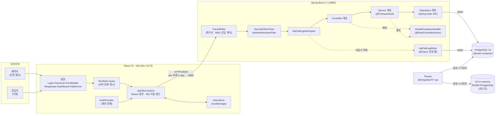

# 03. 시스템 구성도 (Architecture)

## 전체 구성도

브라우저 → 프론트엔드 → 백엔드 → 데이터베이스로 이어지는 단방향 구성입니다. 제작자와 응답자는 같은 프론트엔드를 쓰지만 서로 다른 API 표면(인증 필요 / 공개)을 지납니다.



몇 가지 구성상의 선택을 밝혀 둡니다.

- **CORS 설정이 없습니다.** 개발 환경에서는 Vite 개발 서버의 프록시(`/api` → `localhost:8080`)가 요청을 대신 전달하므로 브라우저 입장에서는 동일 출처입니다. 백엔드에 교차 출처를 열어 두는 것보다 노출 표면이 작고, 인증 헤더·쿠키 정책을 건드릴 일이 없습니다.
- **테스트와 운영이 같은 Flyway 스크립트를 실행합니다.** 테스트는 H2 를 PostgreSQL 호환 모드로 띄우므로 `./gradlew test` 에 Docker 가 필요하지 않으면서도 스키마는 운영과 동일합니다. `spring.jpa.hibernate.ddl-auto=validate` 라 엔티티와 스키마가 어긋나면 기동 시점에 실패합니다.
- **API 호출 이력 적재는 요청 처리와 분리했습니다.** `ApiCallLogWriter` 는 전용 스레드 풀에서 비동기로 저장하고 실패해도 예외를 삼켜 로그만 남깁니다. 부가 기능이 본 요청의 응답 시간이나 성공 여부에 영향을 주지 않아야 하기 때문입니다.

## 계층 책임 분리 (Layered Architecture)

요청은 항상 **Controller → Service → Repository** 단방향으로 흐릅니다. 역방향 호출은 두지 않습니다.

| 계층 | 책임 | 하지 않는 것 |
|---|---|---|
| **Controller** | HTTP 매핑, `@Valid` 요청 검증, 응답 DTO 변환, 상태 코드·`Location` 헤더 결정 | 비즈니스 판단, 트랜잭션 경계 설정, 엔티티 노출 |
| **Service** | 비즈니스 규칙(소유권·상태 전이·응답 검증), 트랜잭션 경계(`@Transactional`) | HTTP 관심사(요청/응답 객체), 화면 표현 |
| **Repository** | 영속성과 조회 쿼리(Spring Data JPA·JPQL·필요 시 네이티브) | 비즈니스 판단 |
| **Domain(Entity)** | 자기 자신으로 판정 가능한 불변식 — 상태 전이 규칙, 편집 가능 여부 | 다른 애그리게이트 조회 |
| **GlobalExceptionHandler** | 예외를 공통 에러 포맷으로 변환하는 **단일 지점** | 비즈니스 판단 |

- **경계에서는 항상 `record` DTO 를 씁니다.** 엔티티를 그대로 직렬화하면 스키마 변경이 곧 API 변경이 되고, 지연 로딩 프록시가 응답 시점에 튀어나옵니다. 응답 DTO 는 정적 팩터리(`FormDetailResponse.of`, `UserResponse.from` 등)로 조립합니다.
- **판정 가능한 규칙은 엔티티에 둡니다.** 폼의 상태 전이(`Form.changeStatus`)와 편집 가능 여부(`Form.requireEditable`)는 폼 자신의 상태만으로 판정되므로 도메인에 응집시켰습니다. 반대로 "이 폼이 이 사용자의 것인가"는 사용자 조회가 필요해 서비스 계층의 협력자(`FormAccessGuard`)가 담당합니다.
- **계층 사이에 보조 협력자를 둔 곳이 두 군데 있습니다.** `FormAccessGuard`(소유권 검사)와 `QuestionLoader`(질문·선택지 일괄 로딩)는 여러 서비스가 공유하는 읽기 로직이라 별도 컴포넌트로 분리했습니다. 형태상 서비스 계층에 속하며, 컨트롤러가 직접 호출하지는 않습니다.

## 패키지 구조

**기능별 최상위 패키지 + 계층 하위 패키지** 구조입니다. 물리적으로는 단일 모듈이지만, 기능 경계를 패키지 규율로 유지하는 모듈러 모놀리스입니다.

```
com.openforms
├── OpenFormsBackendApplication
├── common                       # 기능에 속하지 않는 공통 기반
│   ├── config                   # SecurityConfig 외 — Web·Filter·Async·Jpa·OpenApi 설정
│   ├── security                 # JwtTokenProvider·JwtAuthenticationFilter·SecurityConfig
│   │                            #   RestAuthenticationEntryPoint·RestAccessDeniedHandler
│   ├── exception                # GlobalExceptionHandler·ErrorResponse·BusinessException 계열
│   ├── trace                    # TraceIdFilter·TraceContext
│   ├── apilog                   # ApiCallLogInterceptor·ApiCallLogWriter (+ domain·repository)
│   ├── openapi                  # 반복되는 Swagger 실패 응답 표기용 합성 애노테이션
│   ├── entity                   # AuditableEntity·CreatedEntity (감사 베이스)
│   └── response                 # PageResponse
├── user                         # 계정·인증
│   ├── domain(User·RefreshToken) · repository · service · controller · dto
├── form                         # 폼·질문·선택지·공개 폼 조회
│   ├── domain(Form·Question·QuestionOption·FormStatus·QuestionType)
│   └── repository · service · controller · dto
└── response                     # 응답 제출·조회·집계
    └── domain(Response·Answer) · repository · service · controller · dto
```

- **의존 방향은 `common ← user ← form ← response` 단방향이며 순환이 없습니다.** 역방향 참조가 필요해 보이는 지점은 우회했습니다. 예를 들어 폼 목록의 응답 수는 `form` 이 `response` 의 타입을 알지 않도록 `FormRepository` 의 네이티브 쿼리로 집계합니다.
- **공개 API 의 위치는 리소스를 기준으로 정했습니다.** 인증 여부가 아니라 다루는 리소스를 따르므로, 공개 폼 조회는 `form/controller/PublicFormController`, 익명 응답 제출은 `response/controller/PublicResponseController` 에 있습니다.
- `service`·`controller`·`dto` 패키지는 해당 계층을 실제로 구현하는 시점에 만들었습니다(빈 폴더 선점 없음).

## 요청 흐름 (Request Flow)

### 공통 전처리

모든 요청은 다음 순서를 지납니다.

```
① TraceIdFilter (Ordered.HIGHEST_PRECEDENCE)
     X-Trace-Id / X-Request-Id 를 이어받거나 UUID 발급
     → MDC 적재(이 요청의 모든 로그에 자동 부착) + 응답 헤더 X-Trace-Id
② SecurityFilterChain
     JwtAuthenticationFilter — Bearer 토큰이 유효하면 SecurityContext 에 인증 주입
     (토큰이 없거나 깨졌으면 인증을 주입하지 않고 통과 → 인가 단계에서 401)
③ DispatcherServlet → ApiCallLogInterceptor (Swagger·정적·에러 경로는 제외)
④ Controller → Service → Repository
⑤ afterCompletion: 호출 이력을 비동기 풀로 넘김 (응답은 이미 반환)
```

시큐리티 필터보다 traceId 필터를 먼저 두었습니다. 그래야 인증 실패처럼 컨트롤러에 닿지 못한 요청의 로그에도 traceId 가 남아, 사용자가 캡처한 에러 화면 하나로 서버 로그를 찾을 수 있습니다.

### 예시 1 — 제작자가 폼을 생성합니다 (인증 필요)

```
POST /api/forms                       Authorization: Bearer <access token>
 → JwtAuthenticationFilter            토큰 검증 → principal = 이메일
 → FormController.create()            @Valid 실패 시 400 VALIDATION_FAILED (fieldErrors)
 → FormService.create()               FormAccessGuard.currentUser(email) 로 소유자 해석
                                      SlugGenerator 로 공개 slug 발급, 상태 DRAFT 로 생성
 → FormRepository.save()              INSERT (감사 컬럼은 JPA Auditing 이 채움)
 ← 201 Created  ·  Location: /api/forms/{id}  ·  FormDetailResponse
```

### 예시 2 — 응답자가 공개 폼에 응답을 제출합니다 (익명)

```
POST /api/public/forms/{slug}/responses
 → SecurityFilterChain                /api/public/** 는 permitAll → 인증 없이 통과
 → PublicResponseController.submit()
 → ResponseSubmissionService.submit()
      1. slug 로 폼 조회               없거나 미발행이면 404 FORM_NOT_FOUND
      2. 상태 확인                     CLOSED 면 409 FORM_CLOSED
      3. 응답 검증                     필수 미응답·타입 불일치·범위 초과·폼에 없는 질문 → 400
                                       (필수 누락은 첫 건에서 멈추지 않고 전건을 fieldErrors 로 반환)
      4. Response + Answer 저장
 ← 201 Created  ·  SubmitResponseResult
```

검증 순서를 **404 → 409 → 400** 으로 둔 것은 의도한 것입니다. 존재하지 않는 폼에 "필수 항목이 비었습니다"라고 답하면 응답자가 고칠 수 없는 오류를 고치려 하게 되므로, 더 바깥의 조건부터 판정합니다. 미발행 폼을 "없음"과 같은 404 로 답하는 것도 발행 전 폼의 존재를 숨기기 위한 선택입니다.

### 예시 3 — 비소유자가 남의 폼에 접근합니다 (인가 실패)

```
GET /api/forms/{id}                   Authorization: Bearer <다른 사용자의 토큰>
 → JwtAuthenticationFilter            인증 자체는 성공
 → FormService.get() → FormAccessGuard.requireOwnedForm()
      1. 폼이 존재하지 않으면          404 FORM_NOT_FOUND
      2. 존재하나 소유자가 아니면      AccessDeniedException
 → GlobalExceptionHandler             403 ACCESS_DENIED (공통 에러 포맷)
```

**404 를 먼저, 403 을 나중에 판정합니다.** 순서를 뒤집어 존재하지 않는 폼까지 403 으로 답하면 "403 이 돌아왔으니 그 id 의 폼은 존재한다"는 사실이 새어 나갑니다. 반대로 남의 폼을 404 로 숨기는 선택지도 있으나, 이 서비스에서 폼 id 는 추측의 대상이 아니고 제작자에게는 "없음"과 "권한 없음"이 구분되는 편이 유용해 표준적인 구분을 택했습니다.

### 예시 4 — 액세스 토큰이 만료되어 클라이언트가 갱신합니다

```
GET /api/forms                        만료된 액세스 토큰
 → RestAuthenticationEntryPoint       401 UNAUTHORIZED (필터 단에서 공통 포맷으로 직접 기록)
 ← apiClient 인터셉터
      동시에 401 을 받은 요청들을 하나의 갱신 약속으로 묶습니다(single-flight)
      리프레시 토큰은 1회용이라 동시에 두 번 쓰면 재사용으로 탐지되기 때문입니다
 → POST /api/auth/refresh
      RefreshTokenService  해시로 조회 → 기존 토큰 폐기(revoked_at) → 새 토큰 쌍 발급 (회전)
      이미 폐기된 토큰이 다시 오면 유출로 간주해 해당 사용자의 토큰을 전량 폐기하고 401
 → 원 요청 1회 재시도 (재시도 표식을 달아 무한 루프를 막습니다)
```

## 예외 처리 전략

예외를 응답으로 바꾸는 지점을 **한 곳으로 유지하는 것**이 이 설계의 목표입니다. 다만 스프링에는 컨트롤러에 닿기 전에 끝나는 요청이 있어, 실제로는 두 경로가 존재하고 **출력 포맷을 의도적으로 동일하게 맞췄습니다.**

| 발생 지점 | 처리 주체 | 비고 |
|---|---|---|
| 디스패처 이후(컨트롤러·서비스) | `GlobalExceptionHandler` (`@RestControllerAdvice`) | 대부분의 예외 |
| 시큐리티 필터 단 | `RestAuthenticationEntryPoint`(401) · `RestAccessDeniedHandler`(403) | `@RestControllerAdvice` 가 아직 동작하지 않는 구간 |

두 경로는 `SecurityErrorResponder` 를 통해 같은 `ErrorResponse` 를 씁니다. 클라이언트 입장에서 "인증이 필요하다"는 사실은 같은데 응답 형태가 다르면 에러 처리 코드를 두 벌 써야 하기 때문입니다.

### 예외 계층

도메인 예외는 `BusinessException` 하나를 상속합니다. 예외가 **자신의 상태 코드와 에러 코드를 들고 다니므로**, `common` 이 개별 기능의 에러 코드를 알 필요가 없습니다.

```
BusinessException (abstract, status + code + fieldErrors)
├── BadRequestException      400   (fieldErrors 를 함께 담을 수 있습니다)
├── UnauthorizedException    401
├── ResourceNotFoundException 404
└── ConflictException        409
```

| 예외 | 상태 코드 | 예 |
|---|---|---|
| `MethodArgumentNotValidException` | 400 | `VALIDATION_FAILED` (`fieldErrors` 포함) |
| `HttpMessageNotReadableException` | 400 | `MALFORMED_REQUEST` |
| `BadRequestException` | 400 | `REQUIRED_ANSWER_MISSING`·`ANSWER_OUT_OF_RANGE` |
| `UnauthorizedException` | 401 | `INVALID_CREDENTIALS`·`INVALID_REFRESH_TOKEN` |
| `AccessDeniedException` | 403 | `ACCESS_DENIED` |
| `ResourceNotFoundException` | 404 | `FORM_NOT_FOUND`·`QUESTION_NOT_FOUND` |
| `NoResourceFoundException` | 404 | `RESOURCE_NOT_FOUND` (매핑된 핸들러 없음) |
| `ConflictException` | 409 | `EMAIL_ALREADY_EXISTS`·`FORM_CLOSED` |
| 그 밖의 미처리 예외 | 500 | `INTERNAL_ERROR` (내부 메시지 비노출, 원문은 서버 로그에만) |

### 설계 의도와 현재의 한계

- **`fieldErrors` 는 `@Valid` 전용이 아닙니다.** 필수 응답 누락처럼 도메인 규칙 위반도 항목별 사유를 담아야 해서, 핸들러를 새로 추가하는 대신 `BusinessException` 이 `fieldErrors` 를 지닐 수 있게 확장했습니다. 핸들러를 늘리면 변환 지점이 흩어지지만, 예외 쪽을 확장하면 변환 지점은 계속 한 곳입니다.
- **`code` 와 `message` 의 역할이 다릅니다.** `code` 는 클라이언트가 분기에 쓰는 안정적 식별자, `message` 는 사람이 읽는 설명입니다.
- **한계:** 현재 `@ExceptionHandler(Exception.class)` 가 스프링 MVC 의 기본 예외 해석보다 먼저 잡히므로, 경로 변수 타입 불일치(`GET /api/forms/abc`)나 미지원 메서드가 400·405 가 아니라 500 으로 응답합니다. 자세한 내용과 개선 방향은 [07. 미완성 / 개선하고 싶은 점](07-limitations.md) 에 정리합니다.

응답 본문 포맷과 전체 에러 코드 일람은 [05. API 설계](05-api-design.md) 를 참고하십시오.

## 관련 문서
- [01. 서비스 개요](01-service-overview.md)
- [02. 기술 스택 선택 근거](02-tech-stack.md)
- [04. DB 설계](04-db-design.md)
- [05. API 설계](05-api-design.md)
- [07. 미완성 / 개선하고 싶은 점](07-limitations.md)
