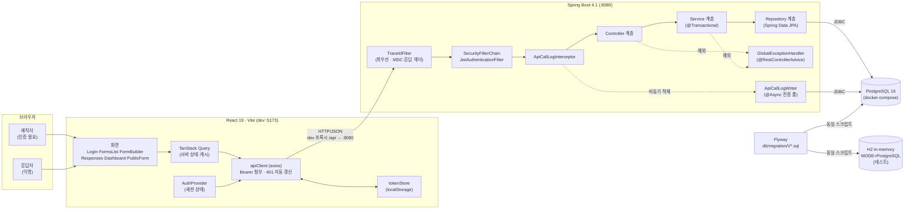

# 03. 시스템 구성도 (Architecture)

## 전체 구성도

브라우저 → 프론트엔드 → 백엔드 → 데이터베이스로 이어지는 단방향 구성입니다. 제작자와 응답자는 같은 프론트엔드를 쓰지만 서로 다른 API 표면(인증 필요 / 공개)을 지납니다.



- **CORS 없음**: Vite dev 프록시(`/api` → `:8080`)로 브라우저 동일 출처 처리. 백엔드 변경 불필요.
- **테스트·운영 동일 Flyway 스크립트**: H2(PostgreSQL 호환 모드) + `ddl-auto=validate`. Docker 없이 `./gradlew test` 통과.
- **API 이력 비동기 저장**: `ApiCallLogWriter`는 전용 스레드 풀에서 독립 실행. 실패해도 본 요청에 영향 없음.

## 계층 책임 분리

요청은 **Controller → Service → Repository** 단방향으로 흐릅니다.

| 계층 | 책임 | 하지 않는 것 |
|---|---|---|
| **Controller** | HTTP 매핑, `@Valid` 검증, DTO 변환, 상태 코드 결정 | 비즈니스 판단, 트랜잭션 경계 |
| **Service** | 비즈니스 규칙, 트랜잭션 경계(`@Transactional`) | HTTP 관심사, 화면 표현 |
| **Repository** | 영속성·조회 쿼리 (JPA / JPQL / 네이티브) | 비즈니스 판단 |
| **Domain(Entity)** | 자기 상태만으로 판정 가능한 불변식 (상태 전이·편집 가능 여부) | 다른 애그리게이트 조회 |
| **GlobalExceptionHandler** | 예외 → 공통 에러 포맷 변환 단일 지점 | 비즈니스 판단 |

보조 협력자: `FormAccessGuard`(소유권), `QuestionLoader`(질문·선택지 일괄 로딩) — 여러 서비스가 공유.

## 패키지 구조 (모듈러 모놀리스)

```
com.openforms
├── common      # security · exception · trace · apilog · openapi · entity
├── user        # 계정·인증 (domain · repository · service · controller · dto)
├── form        # 폼·질문·선택지·공개 폼 조회
└── response    # 응답 제출·조회·집계
```

의존 방향: `common ← user ← form ← response` 단방향, 역방향 없음.

## 요청 흐름

모든 요청: `TraceIdFilter → SecurityFilterChain(JWT) → ApiCallLogInterceptor → Controller → Service → Repository`

**인증 필요 (폼 생성)**

```
POST /api/forms  Authorization: Bearer <token>
 → JWT 검증 → principal = 이메일
 → FormService.create()  소유자 확인, slug 발급, 상태 DRAFT
 ← 201 Created · Location: /api/forms/{id}
```

**익명 응답 제출**

```
POST /api/public/forms/{slug}/responses
 → permitAll 통과 (인증 없음)
 → ResponseSubmissionService: 404(폼 없음) → 409(종료됨) → 400(검증 실패) → 저장
 ← 201 Created
```

## 예외 처리 전략

예외 경로가 두 갈래이지만 **포맷은 동일하게** 맞췄습니다.

| 발생 지점 | 처리 주체 |
|---|---|
| 컨트롤러·서비스 | `GlobalExceptionHandler` (`@RestControllerAdvice`) |
| 시큐리티 필터 단 | `RestAuthenticationEntryPoint`(401) · `RestAccessDeniedHandler`(403) |

```
BusinessException (abstract)
├── BadRequestException      400
├── UnauthorizedException    401
├── ResourceNotFoundException 404
└── ConflictException        409
```
