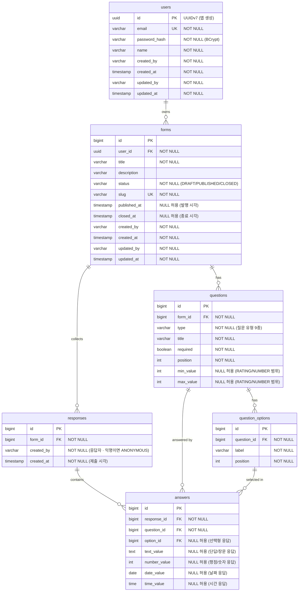

# 04. DB 설계

## ERD



## 테이블 정의서

### users — 폼 제작자 계정
| 컬럼 | 타입 | 제약 | 설명 |
|---|---|---|---|
| id | UUID | PK | UUIDv7, 앱에서 생성 (아래 "식별자(PK) 전략" 참고) |
| email | VARCHAR(255) | NOT NULL, UNIQUE | 로그인 ID |
| password_hash | VARCHAR(255) | NOT NULL | BCrypt 해시 (평문 저장 금지) |
| name | VARCHAR(100) | NOT NULL | 표시 이름 |
| created_by | VARCHAR(100) | NOT NULL | 가입은 비로그인 상태에서 이루어지므로 `ANONYMOUS` 입니다 |
| created_at | TIMESTAMP | NOT NULL | 가입 시각 |
| updated_by | VARCHAR(100) | NOT NULL | 프로필 변경 주체(본인 이메일) |
| updated_at | TIMESTAMP | NOT NULL | |

### forms — 설문 폼
| 컬럼 | 타입 | 제약 | 설명 |
|---|---|---|---|
| id | BIGINT | PK, IDENTITY | |
| user_id | UUID | NOT NULL, FK→users(id) | 소유자 (users.id 가 UUID 이므로 동일 타입) |
| title | VARCHAR(255) | NOT NULL | |
| description | VARCHAR(1000) | NULL | |
| status | VARCHAR(20) | NOT NULL | DRAFT / PUBLISHED / CLOSED |
| slug | VARCHAR(64) | NOT NULL, UNIQUE | 공개 링크 식별자 |
| published_at | TIMESTAMP | NULL | 발행 시각 (미발행이면 NULL) |
| closed_at | TIMESTAMP | NULL | 종료 시각 (미종료면 NULL) |
| created_by | VARCHAR(100) | NOT NULL | 제작자 이메일 (`user_id` 소유자와 동일) |
| created_at | TIMESTAMP | NOT NULL | |
| updated_by | VARCHAR(100) | NOT NULL | 최종 수정자 이메일 |
| updated_at | TIMESTAMP | NOT NULL | |

`published_at`·`closed_at` 은 감사 컬럼과 별개의 **도메인 사실**입니다. 대시보드의 일별 응답 추이가 "발행일부터 종료일까지"의 구간을 그려야 하는데, `updated_at` 은 이후 제목 수정에도 갱신되어 발행 시각의 근거가 될 수 없고 `created_at` 을 쓰면 아직 응답을 받을 수 없던 작성 기간까지 차트에 들어갑니다. 즉 이 두 컬럼은 "언제 수정되었는가"(감사)가 아니라 "언제 그 사건이 일어났는가"(도메인)를 답합니다.

NULL 을 허용하는 이유는 아직 일어나지 않은 사건을 NULL 로 표현하는 것이 정확하기 때문입니다. 상태 전이가 단방향·1회성이므로(`DRAFT → PUBLISHED → CLOSED`) 각 컬럼은 한 번만 채워지고 이후 바뀌지 않습니다. 값의 기록은 상태 전이와 같은 지점(엔티티의 `changeStatus`)에서 이루어져, 상태와 시각이 어긋날 수 없습니다.

### questions — 질문
| 컬럼 | 타입 | 제약 | 설명 |
|---|---|---|---|
| id | BIGINT | PK, IDENTITY | |
| form_id | BIGINT | NOT NULL, FK→forms(id) ON DELETE CASCADE | |
| type | VARCHAR(20) | NOT NULL | 질문 유형 9종 (아래 "질문 타입" 참고) |
| title | VARCHAR(500) | NOT NULL | 질문 문구 |
| required | BOOLEAN | NOT NULL | 필수 응답 여부 |
| position | INT | NOT NULL | 폼 내 정렬 순서 |
| min_value | INT | NULL | RATING/NUMBER 의 허용 최솟값 |
| max_value | INT | NULL | RATING/NUMBER 의 허용 최댓값 |

`min_value`/`max_value` 는 RATING·NUMBER 에서만 사용하며 나머지 타입에서는 NULL 입니다. 제작자가 평점 척도(예: 1~5, 1~10)를 직접 정의하고, 서비스단 응답 검증(400)이 이 값을 근거로 삼습니다.

### question_options — 선택지 (선택형 질문용)
| 컬럼 | 타입 | 제약 | 설명 |
|---|---|---|---|
| id | BIGINT | PK, IDENTITY | |
| question_id | BIGINT | NOT NULL, FK→questions(id) ON DELETE CASCADE | |
| label | VARCHAR(255) | NOT NULL | 선택지 문구 |
| position | INT | NOT NULL | 정렬 순서 |

### responses — 응답 제출 1건 (익명, 제출 후 불변)
| 컬럼 | 타입 | 제약 | 설명 |
|---|---|---|---|
| id | BIGINT | PK, IDENTITY | |
| form_id | BIGINT | NOT NULL, FK→forms(id) ON DELETE CASCADE | |
| created_by | VARCHAR(100) | NOT NULL | 응답자. 익명 제출이면 `ANONYMOUS` 입니다 |
| created_at | TIMESTAMP | NOT NULL | 제출 시각 (시계열 집계용) |

제출 시각을 `submitted_at` 이라는 별도 컬럼으로 두지 않고 `created_at` 으로 통합하였습니다. 감사 컬럼을 도입하면 두 컬럼의 의미가 완전히 중복되기 때문입니다. API 응답 DTO 는 `submittedAt` 이라는 도메인 용어를 그대로 노출할 수 있습니다.

`updated_by`/`updated_at` 은 두지 않습니다. 응답은 제출 후 수정할 수 없으므로(아래 "응답 불변 정책") 두 컬럼은 영구히 `created_by`/`created_at` 과 같은 값이 되어 정보를 더하지 않습니다.

### answers — 제출된 값 1건
| 컬럼 | 타입 | 제약 | 설명 |
|---|---|---|---|
| id | BIGINT | PK, IDENTITY | |
| response_id | BIGINT | NOT NULL, FK→responses(id) ON DELETE CASCADE | |
| question_id | BIGINT | NOT NULL, FK→questions(id) ON DELETE CASCADE | |
| option_id | BIGINT | NULL, FK→question_options(id) ON DELETE CASCADE | 선택형 응답이 고른 선택지 |
| text_value | TEXT | NULL | 단답(SHORT_TEXT)/장문(LONG_TEXT) 응답 |
| number_value | INT | NULL | 평점(RATING)/숫자(NUMBER) 응답 |
| date_value | DATE | NULL | 날짜(DATE) 응답 |
| time_value | TIME | NULL | 시간(TIME) 응답 |

이 테이블의 한 행은 **"제출된 값 하나"** 이며, 질문당 1행이 아닙니다. 값 입력형과 택1형은 1행이지만, 체크박스(MULTIPLE_CHOICE)는 고른 선택지 개수만큼 행이 생깁니다. 한 행에서는 `option_id` 와 값 컬럼 네 개 중 **정확히 하나만** 채워집니다.

날짜·시간을 `text_value` 에 문자열로 저장하지 않고 DATE/TIME 타입 컬럼으로 분리한 이유는, 범위 검색·정렬·집계를 DB 타입 수준에서 정확하게 수행하기 위함입니다.

## 질문 타입 (9종) 과 응답 저장 매핑

`questions.type` 은 아래 9종이며 애플리케이션 Enum 으로 관리합니다. 타입마다 응답이 저장되는 위치가 다르므로 함께 정의합니다.

| 타입 | 설명 | 선택지 | 응답 저장 위치 |
|---|---|---|---|
| SHORT_TEXT | 한 줄 단답 | 없음 | `answers.text_value` (1행) |
| LONG_TEXT | 여러 줄 장문 | 없음 | `answers.text_value` (1행) |
| SINGLE_CHOICE | 라디오 버튼 (택 1) | 필수 | `answers.option_id` (1행) |
| DROPDOWN | 드롭다운 (택 1) | 필수 | `answers.option_id` (1행) |
| MULTIPLE_CHOICE | **체크박스** (택 N) | 필수 | `answers.option_id` (고른 개수만큼 N행) |
| RATING | 평점 척도 | 없음 | `answers.number_value` (1행) |
| NUMBER | 숫자 입력 | 없음 | `answers.number_value` (1행) |
| DATE | 날짜 선택 | 없음 | `answers.date_value` (1행) |
| TIME | 시각 선택 | 없음 | `answers.time_value` (1행) |

설계 근거를 몇 가지 밝힙니다.

- **체크박스는 별도 타입이 아닙니다.** 체크박스는 곧 다중선택이므로 기존 `MULTIPLE_CHOICE` 가 그대로 대응합니다. 타입을 새로 만들면 저장 구조가 동일한 두 타입이 생겨 집계 로직이 중복됩니다.
- **DROPDOWN 은 `SINGLE_CHOICE` 와 저장 구조가 같지만 타입을 분리합니다.** 저장은 같아도 제작자가 의도한 표현 방식(라디오 vs 드롭다운)이 다르고, 이는 서버가 프론트에 전달해야 하는 정보입니다. 프론트가 선택지 개수 같은 휴리스틱으로 렌더링을 추측하게 두지 않습니다.
- **RATING 과 NUMBER 는 `number_value` 를 공유합니다.** 둘 다 정수 하나이며 `min_value`~`max_value` 로 범위를 검증한다는 점에서 동일합니다. 차이는 프론트 렌더링(별점/스피너)뿐이므로 저장 컬럼을 나눌 이유가 없습니다.
- **DATE/TIME 은 값 컬럼을 추가합니다.** `text_value` 에 ISO 문자열로 넣으면 저장은 되지만 "특정 기간 응답만 집계" 같은 질의에서 문자열 비교에 의존하게 되고 형식 오류를 DB 가 걸러주지 못합니다.
- **선택지 참조는 조인 테이블 없이 `answers.option_id` 로 둡니다.** 다중선택이 개념적으로 N:M 이라는 이유로 조인 테이블(`answer_options`)을 둘 수도 있지만, 그러면 **가장 흔한 택1형이 값 하나를 저장하려고 행 두 개**(answers + answer_options)를 쓰게 됩니다. 흔한 경우가 드문 경우의 비용을 내는 구조입니다. `answers` 를 "값 1건"으로 정의하면 다중선택은 행 여러 개로 자연스럽게 표현되고, 조인 테이블이 사라지며, 대시보드의 핵심 질의인 선택지별 집계가 조인 없이 끝납니다.

  ```sql
  -- 선택지별 선택 수 (조인 없음)
  SELECT option_id, COUNT(*) FROM answers
   WHERE question_id = ? AND option_id IS NOT NULL
   GROUP BY option_id;
  ```

  그 대가로 `answers` 는 (response_id, question_id) 당 1행이 아니게 되므로, 응답 상세 조회 시 서비스 계층에서 `question_id` 로 그룹핑하여 "질문의 답변"을 조립합니다. 향후 "기타(직접 입력)" 선택지를 지원할 때 같은 행의 `option_id` 와 `text_value` 를 함께 쓸 수 있다는 이점도 있습니다.

## 감사 컬럼 정책

`created_by` · `created_at` · `updated_by` · `updated_at` 4종을 기본으로 하되, **모든 테이블에 일괄 적용하지는 않습니다.**

| 테이블 | 적용 | 근거 |
|---|---|---|
| users | O (4종) | 계정은 독립적인 생명주기를 가지며 프로필 변경 이력이 필요합니다 |
| forms | O (4종) | 소유권·수정 이력이 핵심 도메인 정보입니다 |
| responses | △ (`created_*` 2종) | 제출 주체(익명 여부)와 제출 시각은 필요하지만, 제출 후 수정이 불가하므로 `updated_*` 는 두지 않습니다 |
| questions | X | 폼에 종속되어 함께 생성·수정·삭제되므로 감사값이 항상 상위 `forms` 와 동일합니다 |
| question_options | X | 위와 같습니다 (questions 에 종속) |
| answers | X | 응답에 종속됩니다. 최다 행을 가지는 테이블이라 행마다 4컬럼을 더하면 저장 용량만 늘고 얻는 정보는 상위 `responses` 와 같습니다 |

즉 판단 기준은 **"그 컬럼이 새로운 정보를 담는가"** 입니다. 상위 엔티티와 항상 함께 생성·삭제되는 종속 테이블의 감사 컬럼은 상위의 값을 되풀이할 뿐이고, 불변 테이블의 `updated_*` 는 `created_*` 를 되풀이할 뿐입니다. 4종을 기본으로 삼되 기계적으로 붙이지는 않습니다.

**주체 표현**: `created_by`/`updated_by` 는 FK 가 아닌 `VARCHAR(100)` 이며, 로그인 상태면 이메일을, 비로그인 상태면 `ANONYMOUS` 를 기록합니다. FK 로 두면 익명을 NULL 로 표현해야 하고("익명 제출"과 "값 누락"이 구분되지 않습니다) 계정 삭제 시 감사 기록이 제약을 받기 때문입니다.

**구현 방향**: Spring Data JPA Auditing 의 `@CreatedBy` · `@CreatedDate` · `@LastModifiedBy` · `@LastModifiedDate` 를 공통 `@MappedSuperclass` 로 묶고, `AuditorAware<String>` 구현체가 `SecurityContext` 에서 인증 주체를 해석합니다. 인증이 없거나 익명 토큰이면 `ANONYMOUS` 를 반환합니다.

`users` 의 `created_by` 는 항상 `ANONYMOUS` 입니다. 회원가입은 비로그인 상태에서 이루어지므로 생성 시점에는 인증 주체가 존재하지 않기 때문이며, 이는 `AuditorAware` 규칙을 계정 생성에도 예외 없이 적용한 결과입니다.

## 응답 불변 정책

응답은 **제출 후 수정할 수 없습니다**(immutable). 응답자 본인도, 폼 제작자도 수정할 수 없으며 제작자는 삭제만 가능합니다.

- 응답 수정 API 를 두지 않습니다. 응답에 대한 제작자 API 는 조회와 삭제(204)뿐입니다.
- 익명 응답자에게 수정을 허용하려면 제출 시 발급하는 `edit_token` 같은 소지 기반(bearer) 인증 수단이 필요하고, 제작자에게 허용하면 응답자가 제출하지 않은 내용이 응답자 명의로 남게 됩니다. 어느 쪽도 익명 설문의 신뢰를 해칩니다.
- 그 대가로 **집계 정합이 단순해집니다.** 응답이 불변이므로 집계 결과는 "제출 시점의 사실"과 항상 일치하며, 사후 수정으로 통계가 소급해 바뀌는 상황이 발생하지 않습니다.

이 정책이 스키마에 남긴 흔적이 `responses` 에 `updated_*` 가 없는 것입니다. 수정을 허용하지 않는 테이블에 변경자·변경일자를 두면 영구히 생성값과 같은 값을 저장하게 됩니다.

응답 수정 요구가 생긴다면 `responses` 에 `edit_token VARCHAR(64) UNIQUE` 를 추가하고 제출 응답에 수정 링크를 반환하는 방식이 자연스러운 확장 경로입니다.

## 식별자(PK) 전략

**`users` 만 UUID(UUIDv7), 나머지 테이블은 `BIGINT IDENTITY`** 라는 혼합 전략을 사용합니다. 두 선택의 근거를 함께 남깁니다.

### 왜 대부분은 BIGINT 인가

- **순차 ID 자체는 취약점이 아닙니다.** IDOR 을 막는 것은 소유권 검사(403)이지 식별자의 추측 불가능성이 아닙니다. UUID 를 인가의 대체재로 쓰는 것은 security through obscurity 이며, 인가가 있다면 불필요하고 인가가 없다면 UUID 로도 안전하지 않습니다.
- **공개 경로는 이미 열거가 불가능합니다.** 익명 사용자가 접근하는 유일한 경로인 공개 폼 링크는 `forms.id` 가 아니라 `forms.slug` 를 사용합니다. 제작자 API 의 `{id}` 는 인증과 소유권 검사 뒤에 있습니다.
- **UUID 의 비용은 인덱스에 있습니다.** 16바이트로 인덱스가 커지며, 특히 UUIDv4(랜덤)는 B-tree 삽입 지역성을 깨뜨립니다. 본 서비스는 읽기·집계 중심이고 `answers` 가 최다 행과 집계 인덱스를 지고 있어 이 비용이 가장 크게 드러나는 구조입니다.

### 왜 `users` 만 UUID 인가

순차 PK 가 남기는 유일한 실질 위험은 **정보 누출**입니다. 순차 ID 는 식별자만으로 사업 규모를 추정하게 합니다. 그중 가장 민감한 것이 **가입자 수**(users.id 최댓값 ≈ 누적 가입자)이며, 이는 인가로 막을 수 없습니다. `users.id` 를 UUID 로 바꾸면 이 누출이 정확히 사라집니다.

이 자리에 UUID 를 적용하는 비용은 거의 없습니다. `users` 는 저볼륨(가입 이벤트에서만 증가)이라 인덱스 지역성 비용이 무시할 수준이고, 최다 행 테이블인 `answers`·`responses` 는 BIGINT 로 남아 집계 성능에 영향이 없습니다. 즉 **가장 이득이 크고 비용이 작은 한 곳** 에만 UUID 를 씁니다. (`forms.id` 의 누적 폼 수 누출은 상대적으로 덜 민감하여 BIGINT 를 유지하며, 필요 시 같은 방식으로 확장할 수 있습니다.)

**생성 방식**: Hibernate 7.4.1.Final(Spring Boot 4.1.0 이 해석하는 버전)의 `@UuidGenerator(style = VERSION_7)` 로 애플리케이션에서 생성합니다. UUIDv7 은 시간 정렬이라 B-tree 삽입 지역성을 유지해 랜덤 UUID(v4)의 단점을 피합니다. 또한 앱이 값을 채우므로 DDL 에 기본값이 필요 없어, `gen_random_uuid()`(PostgreSQL) / `RANDOM_UUID()`(H2) 같은 DB 종속 함수를 쓰지 않고 `UUID NOT NULL PRIMARY KEY` 만으로 두 DB 이식성을 유지합니다.

`forms.user_id` 는 `users.id` 를 참조하므로 함께 UUID 입니다.

## 연관관계 (서비스 로직과의 매칭)

| 관계 | 카디널리티 | 서비스 근거 |
|---|---|---|
| users → forms | 1:N | 한 제작자가 여러 폼 소유. 소유권 검사(403)의 기준 |
| forms → questions | 1:N | 폼은 여러 질문 보유. 폼 상세 조회 시 함께 로드 |
| questions → question_options | 1:N | 선택형 질문(SINGLE_CHOICE·DROPDOWN·MULTIPLE_CHOICE)의 선택지 |
| forms → responses | 1:N | 폼은 여러 응답 수집. 목록/집계의 기준 |
| responses → answers | 1:N | 한 응답은 여러 값 행의 묶음 |
| questions → answers | 1:N | 질문별 응답 집계(per-question aggregation) |
| question_options → answers | 1:N | 한 선택지는 여러 응답에서 선택됩니다. MULTIPLE_CHOICE 는 한 질문에 대해 answers 가 여러 행이 되어 다중선택을 표현합니다 |

**정규화 수준**: 3NF 입니다. 선택지 응답을 `answers.text_value` 에 라벨 문자열로 중복 저장하지 않고 `option_id` FK 로 참조하므로, 선택지 라벨이 바뀌어도 집계 정합이 유지됩니다. 조인 테이블을 두지 않은 것은 정규화를 포기한 것이 아닙니다 — 다중선택을 "행 여러 개"로 표현하면 N:M 이 1:N 두 개로 분해되어 조인 테이블 없이도 3NF 가 성립합니다. 반대 방향의 과도한 분해(예: 값 타입별 테이블 분리)도 피합니다.

## 인덱스 설계 및 이유

| 인덱스 | 대상 | 종류 | 이유 |
|---|---|---|---|
| `uk_users_email` | users(email) | UNIQUE | 로그인 시 이메일 조회(고빈도) + 중복 가입 방지 |
| `uk_forms_slug` | forms(slug) | UNIQUE | 공개 링크 접속마다 slug로 폼 조회(고빈도 읽기) + 링크 유일성 |
| `ix_forms_user_id` | forms(user_id) | 일반 | "내 폼 목록" 조회 시 소유자 필터 (FK, 고빈도) |
| `ix_forms_user_status` | forms(user_id, status) | 복합 | 내 폼을 상태로 필터링(예: 발행된 폼만)하는 목록 API |
| `ix_questions_form_id` | questions(form_id) | 일반 | 폼 상세 로드 시 질문 조회 (FK) |
| `ix_question_options_question_id` | question_options(question_id) | 일반 | 질문의 선택지 로드 (FK) |
| `ix_responses_form_created` | responses(form_id, created_at) | 복합 | 특정 폼의 **일별 응답 추이** 집계 — form_id 필터 + created_at 범위/정렬 |
| `ix_answers_question_option` | answers(question_id, option_id) | 복합 | **질문별 응답 분포**(question_id 필터)와 **선택지별 선택 수**(option_id 그룹핑) 집계를 한 인덱스로 처리 |
| `ix_answers_response_id` | answers(response_id) | 일반 | 응답 상세 조회 시 답변 로드 (FK) |

> 인덱스 판단 기준은 (1) FK 조인 컬럼, (2) 조회/집계 필터·정렬에 자주 쓰이는 컬럼입니다. 쓰기보다 읽기·집계가 많은 대시보드 특성을 반영하여 집계 경로에 복합 인덱스를 배치했습니다.

`ix_answers_question_option` 을 복합으로 둔 이유를 밝힙니다. 최좌측 프리픽스 규칙에 따라 이 인덱스는 `question_id` 단독 필터에도 그대로 쓰이므로 별도의 `answers(question_id)` 단일 인덱스가 필요 없고, 여기에 `option_id` 를 더해 차트의 선택지별 집계까지 커버합니다. 인덱스 하나로 두 집계 경로를 처리하여 쓰기 비용을 줄입니다.

감사 컬럼에는 인덱스를 두지 않습니다. `created_by`/`updated_by` 는 기록·추적 목적이며 조회 필터나 정렬 조건으로 사용하는 API 가 없기 때문입니다(`created_at` 은 `ix_responses_form_created` 에 이미 포함되어 있습니다). 쓰이지 않는 인덱스는 쓰기 비용만 늘립니다.

## 제약조건 요약
- **NOT NULL**: 모든 식별/상태/시각/감사 컬럼에 적용합니다. NULL 을 허용하는 것은 응답값(`option_id`·`text_value`·`number_value`·`date_value`·`time_value` — 타입에 따라 하나만 채워집니다), 질문 범위 메타(`min_value`·`max_value`), `forms.description` 뿐입니다.
- **감사 컬럼**: users·forms 는 4종, responses 는 `created_*` 2종이며 모두 NOT NULL 입니다. users·forms 는 생성 시점에 `updated_by`/`updated_at` 을 `created_by`/`created_at` 과 동일한 값으로 채웁니다.
- **UNIQUE**: users.email, forms.slug 에 적용합니다.
- **FK + ON DELETE CASCADE**: 폼 삭제 시 questions·question_options·responses·answers 를 연쇄 삭제합니다(고아 레코드 방지).

  `answers` 는 세 개의 FK(`response_id`·`question_id`·`option_id`) **모두** 에 CASCADE 를 겁니다. 폼 삭제 시 연쇄 경로가 `responses → answers` 와 `questions → answers`(및 `questions → question_options → answers`) 두 갈래로 갈라지기 때문입니다. 한쪽에만 CASCADE 를 걸면 다른 갈래가 먼저 지워질 때 남은 `answers` 행이 참조 무결성 검사에 걸려 **폼 삭제 자체가 실패**합니다. 실제 PostgreSQL 에서 재현하여 확인한 사항입니다.
- **CHECK(암묵)**: status/type 는 애플리케이션 Enum 으로 값 무결성을 보장합니다. 질문 타입별로 어느 값 컬럼이 채워져야 하는지(`option_id` 포함), `number_value` 가 `min_value`~`max_value` 범위에 드는지 역시 서비스 계층에서 검증하며 위반 시 400 을 반환합니다.

## 스키마 관리 (Flyway)
- DDL 은 `src/main/resources/db/migration/V1__init.sql` 등 Flyway 스크립트를 **단일 진실 원천**으로 삼습니다.
- 이 문서의 테이블 정의서와 Flyway 스크립트, JPA 엔티티가 3자 일치하도록 유지합니다(정합성). `spring.jpa.hibernate.ddl-auto=validate` 이므로 엔티티가 스키마와 어긋나면 기동 시점에 실패합니다.
- 운영/개발은 PostgreSQL, 테스트는 H2(PostgreSQL 호환 모드)를 사용하며 **동일한 스크립트**를 실행합니다. 따라서 DDL 은 두 DB 에서 모두 동작하는 이식 가능한 문법만 사용합니다(PostgreSQL 전용 문법 금지).
- 적용된 스크립트는 `V1__init.sql`(초기 스키마), `V2__api_call_logs.sql`(API 호출 이력), `V3__form_lifecycle_timestamps.sql`(`forms.published_at`·`closed_at`)입니다.

이식성 규칙은 DDL 뿐 아니라 **집계 질의**에도 적용됩니다. 실제로 대시보드 집계를 구현하며 세 번 걸렸습니다 — 별칭 `day`·`value` 가 H2 에서 예약어라 문법 오류가 났고(PostgreSQL 에서는 통과합니다), 날짜 집계는 H2 가 `LocalDate` 를 PostgreSQL 드라이버가 `java.sql.Date` 를 돌려주어 결과 투영이 실패했습니다. 앞의 둘은 별칭을 바꿔, 뒤의 하나는 네이티브 질의를 JPQL 로 바꿔 방언 차이를 Hibernate 가 흡수하게 해결했습니다. 두 DB 에서 같은 스크립트·같은 질의를 돌린다는 원칙이 없었다면 운영에서야 드러났을 문제들입니다.

## 관련 문서
- [01. 서비스 개요](01-service-overview.md)
- [03. 아키텍처](03-architecture.md) — Repository 계층
- [05. API 설계](05-api-design.md) — 이 스키마를 사용하는 엔드포인트
- [07. 미완성 / 개선하고 싶은 점](07-limitations.md) — 순차 PK 의 정보 노출 등
