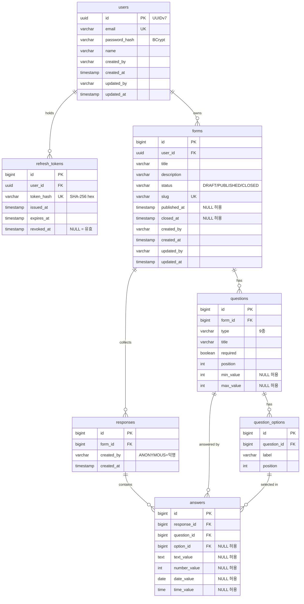

# 04. DB 설계

## ERD

## 질문 타입 (9종) & 응답 저장 방식

| 타입 | 저장 컬럼 | 비고 |
|---|---|---|
| SHORT_TEXT / LONG_TEXT | text_value (1행) | |
| SINGLE_CHOICE / DROPDOWN | option_id (1행) | |
| MULTIPLE_CHOICE | option_id (N행) | 선택 수만큼 행 생성 |
| RATING / NUMBER | number_value (1행) | min_value·max_value 범위 검증 |
| DATE / TIME | date_value / time_value (1행) | |

한 행에서 값 컬럼 4개 중 정확히 하나만 채워짐.

## 주요 설계 결정

**감사 컬럼 선택 적용**: users·forms → 4종 전부. responses → created 2종(불변). questions·answers → 없음(상위와 동일값). `created_by`/`updated_by`는 FK 대신 VARCHAR — 익명을 `ANONYMOUS`로 표현, 계정 삭제 시 감사 기록 보존.

**refresh_tokens 설계**: JWT는 무상태라 서버가 폐기 불가. "갱신할 권리"만 DB로 관리. `revoked_at`으로 행 보존(삭제 않음) → 재사용 탐지. 해시 조회가 필요해 SHA-256 사용(BCrypt는 조회 불가).

**published_at / closed_at**: `updated_at`과 별개의 도메인 사실. 제목 수정 시 `updated_at`이 갱신되므로 발행 시각으로 쓸 수 없음.

**식별자 전략**: `users`만 UUID(v7). 가입자 수 추정이 가장 민감한 테이블에만 비용 집중. 나머지는 BIGINT IDENTITY. 공개 경로는 예측 불가 `slug`.

**answers FK 전체 CASCADE**: `response_id`·`question_id`·`option_id` 모두 CASCADE. 하나라도 빠지면 폼 삭제 시 FK 위반 — PostgreSQL 실측 확인.

**응답 불변**: 제출 후 수정 불가. 제작자도 삭제만 가능. responses에 `updated_*` 없음.

## 인덱스 설계

| 인덱스 | 컬럼 | 목적 |
|---|---|---|
| uk_users_email | users(email) | 로그인 조회 + 중복 방지 |
| uk_forms_slug | forms(slug) | 공개 링크 조회 + 유일성 |
| ix_forms_user_status | forms(user_id, status) | 내 폼 목록 + 상태 필터. 단독 user_id도 커버 |
| ix_questions_form_id | questions(form_id) | 폼 상세 질문 로드 |
| ix_question_options_question_id | question_options(question_id) | 선택지 로드 |
| ix_responses_form_created | responses(form_id, created_at) | 응답 목록 + 일별 추이 집계 |
| ix_answers_question_option | answers(question_id, option_id) | 질문별·선택지별 집계 |
| ix_answers_response_id | answers(response_id) | 응답 상세 답변 로드 |
| uk_refresh_tokens_token_hash | refresh_tokens(token_hash) | 갱신 시 토큰 단건 조회 |
| ix_refresh_tokens_user_id | refresh_tokens(user_id) | 사용자 토큰 전량 폐기 |

## 스키마 관리 (Flyway)

`V1__init.sql` → `V2__api_call_logs.sql` → `V3__form_lifecycle_timestamps.sql` → `V4__refresh_tokens.sql`

운영(PostgreSQL)·테스트(H2 PostgreSQL 호환 모드) 동일 스크립트. `ddl-auto=validate`로 불일치 시 기동 실패.
